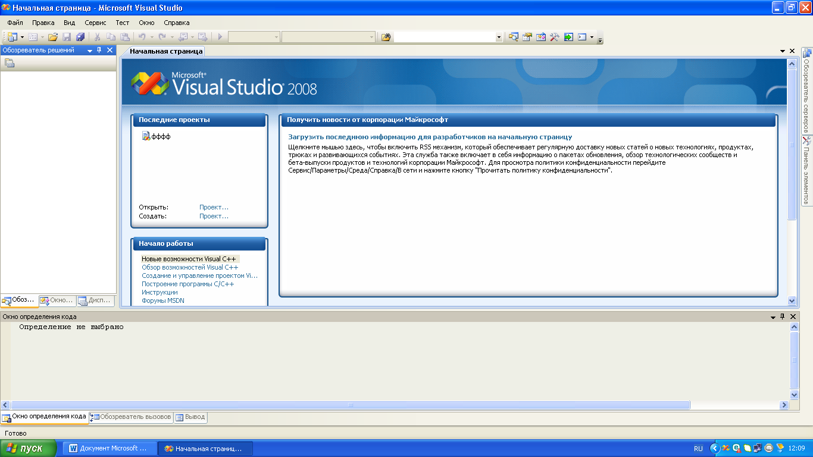
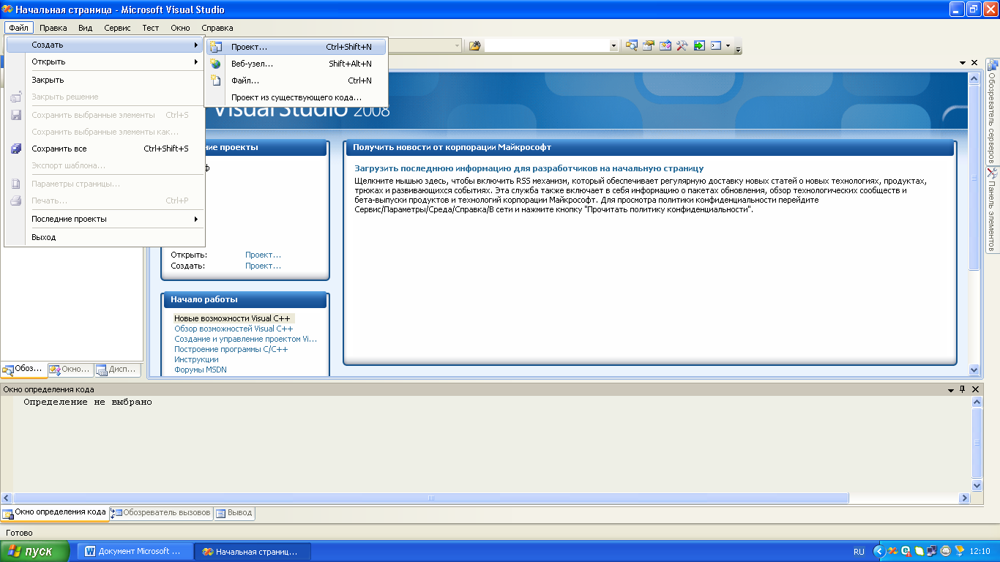
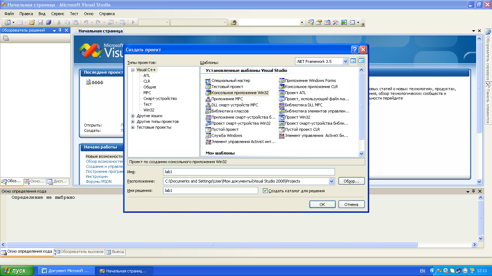
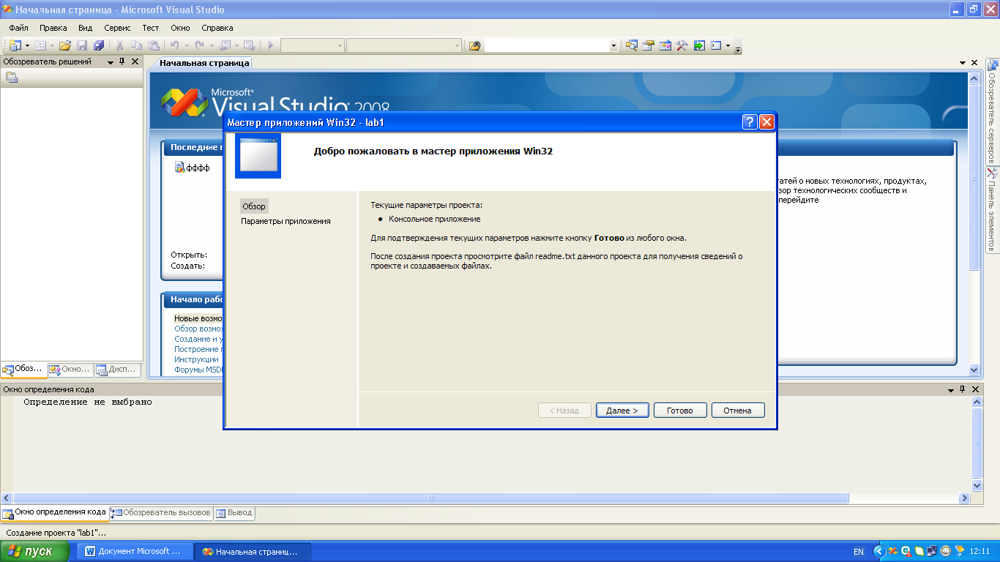
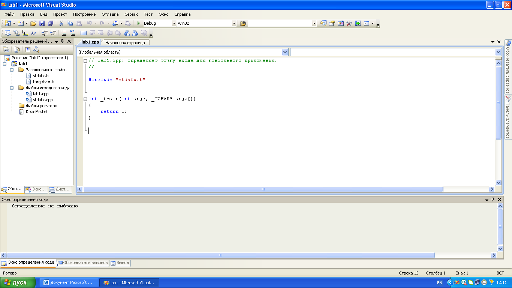
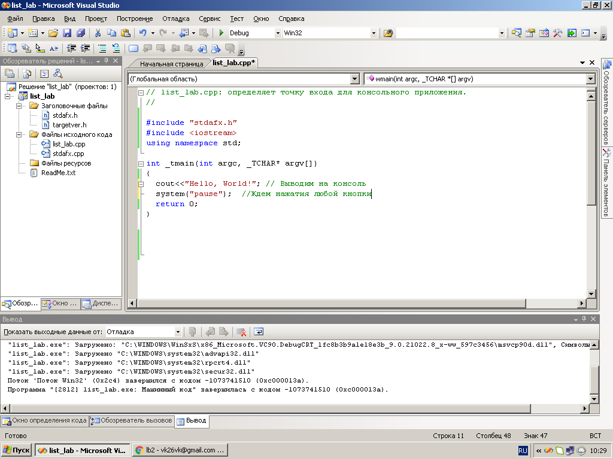
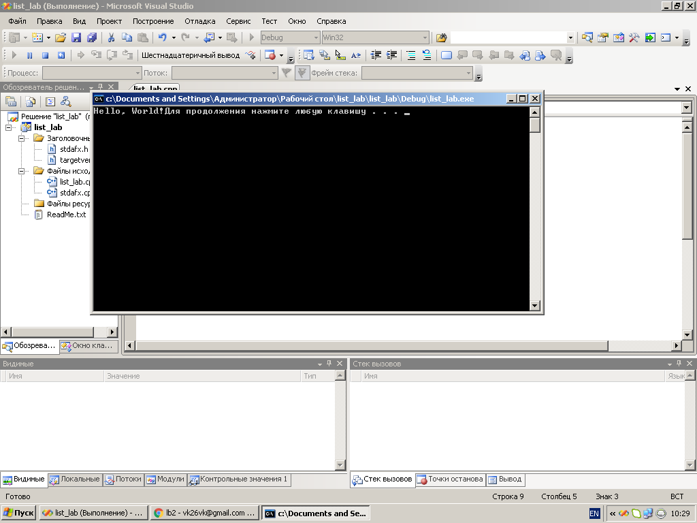
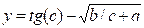
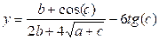

# 01. Створення лінійної програми. Введення-виведення даних

[Перелік усіх робіт](README.md)

## Мета роботи 

Ознайомитись з IDE Visual Studio. Навчитися створювати проект. Здобути навички у знаходженнi мінімального і максимального значення в масиві.
Обладнання та ПЗ: персональний комп’ютер, Visual Studio 2008.

## Теоретичні відомості

### Компілятори С++

### Середовища розробки

## Обладнання

Персональний комп’ютер, Visual Studio 2008 або інша середа розробки для мови C++

## Хід роботи

1. Завантажити програму Visual Studio 2008. Знайдіть на робочому столі ярлик з Visual Studio 2008 або Пуск → Всі програми → Microsoft → Microsoft Visual Studio 2008.
2.	Ознайомитися з інтерфейсом Visual Studio 2008.



3.	Створити новий проект «Visual C++ (консольное приложение Win32)». Для того щоб створити новий проект в головному меню виберемо Файл → Cтворити → Проект. Далі виберемо мову програмування «Visual C++» і тип проекту «Консольное приложение Win32». Введемо ім'я проекту і вкажемо розташування файлів проекту. Натиснемо «ОК», в наступному вікні необхідно натиснути «Готово».









4.	Приклад створення програми «Hello, World» 



5.	Приклад виконання програми «Hello, World» 



6.	Перевірити програму, що обчислює вираз  та скласти блок-схему

```cpp
#include "stdafx.h"
#include <iostream>
#include <conio.h>
#include <math.h>
using namespace std;
void main()
{
	float a,b,c,y;
	cout<<"Enter a, b, c: ";
	cin>>a>>b>>c;
	y=tan(c)-sqrt(b/c+a);
	cout<<"\n y="<<y;
	getch();  
}
```

7.	Написати програму, що обчислює вираз  та скласти блок-схему

8.  Написати програму для обчислення завдання згідно з варіантом
	1. Дано двозначне число. Знайти суму і частку його цифр.
	2. Дано двозначне число. Вивести число, отримане при перестановці цифр
	вихідного числа.
	3. Дано тризначне число. Використовуючи одну операцію цілочисельного
	ділення, вивести першу цифру даного числа (сотні) і другу цифру (десятки).
	4. Дано тризначне число. Вивести спочатку його останню цифру (одиниці), а
	потім - його середню цифру (десятки).
	5. Дано тризначне число. Знайти суму і добуток його цифр.
	6. Дано тризначне число. Вивести число, отримане при прочитанні вихідного
	числа справа наліво.
	7. Дано тризначне число. У ньому закреслили першу зліва цифру і приписали її
	справа. Вивести отримане число.
	8. Дано тризначне число. У ньому закреслили першу праворуч цифру і
	приписали її зліва. Вивести отримане число.
	9. Дано тризначне число. Вивести число, отримане при перестановці цифр
	сотень і десятків вихідного числа (наприклад, 123 перейде в 213).
	10. Дано ціле число, більше 999. Використовуючи одну операцію ділення і одну
	операцію взят


9. Скласти звіт про роботу та відповісти на контрольні питання. Додати у звіт код програм, намалювати блоксхеми
10. Зберегти звіт у форматі PDF та надати викладачу на перевірку.

## Контрольні питання

1.	Правила запису ідентифікаторів
2.	Призначення констант
3.	Призначенния конструкцій cin та cout
4.	Охарактеризувати тип int
5.  Які типи даних можуть зберігати числа з дробовою частиною?
6.  Чим відрізняється операція ділення '10.0/2' від '10/2'?
7.  Яку іункцію виконує оператор `%`?

## Довідники та додаткові матеріали

1. [Написання першої програми на С++](https://codeguida.com/post/668/) 
2. [Написання простої лінійної програми на мові С++](https://stud.com.ua/254838/programuvannia/napysannia-prohramy-na-movie-c-yak-napisaty-prostu-linijnu-prohramu) 
3. [Створення першої програми на С++ в Linux](https://code-maven.com/create-your-first-c-plus-plus-program-on-linux) [Написання першої програми на С++](https://studway.com.ua/cplusplus/persha-programa-na-c-) 
4. [Написання першої програми на С++](https://uchitelya.com/programming/cpp/first-program) 
5. [Writing your first C++ program - Hello World example](https://www.geeksforgeeks.org/writing-first-c-program-hello-world-example/) 
6. [Learn C](https://www.learn-c.org/) 
7. [Codecademy - Learn C++](https://www.codecademy.com/learn/learn-c-plus-plus) 
8. [C++ Examples](https://www.programiz.com/cpp-programming/examples) 
9. [C++ Basic Syntax](https://www.tutorialspoint.com/cplusplus/cpp_basic_syntax.htm)