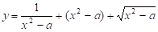
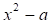
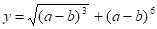
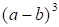
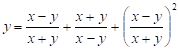
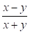
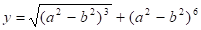
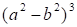
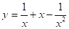
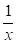

# 11. Створення користувацькийх функцій та бібліотек

[Перелік усіх робіт](README.md)

## Мета роботи 

Отримати навички роботи з функціями у мовах програмування C та С++, навчитися користуватися прототипами функцій

## Обладнання

Персональний комп’ютер, Visual Studio 2008 або інша середа розробки для мови C++

## Теоретичні відомості

### Загальне про функції

Усі функції мають однакову структуру визначення у вигляді:

```
[тип результату] ім'я функції ([список формальних аргументів])
{ // тіло функції
	опис даних;
	оператори;
	[return] [вираз];
};// кінець тіла функції
```

Оголошення функції (прототип, заголовок) задає ім'я функції, тип значення, що повертає функція (якщо воно є), а також імена та типи аргументів, які можуть передаватися як у функцію, так і з неї. Визначення функції — це задання способу виконання операцій.

```cpp
double sqr (double); // прототип функції sqr()

main( ) // головна функція
{ // виклик функції sqr()
	cout << "Квадрат числа=" << sqr (10) << endl;
}

double sqr (double p) //-- функция sqr()
{ 
	return p*p; // повернення значення
} 

```

### Модулі та заголовкові файли

Модуль у С++ - це файл, який містить в собі функції та інші об'єкти, які можуть бути використані в інших частинах програми.

Створення модуля у С++ може бути здійснене у кілька кроків:

1. Написання коду функцій та інших об'єктів, які мають бути включені до модулю.
2. Створення файлу з розширенням ".cpp", у якому міститься весь код модуля.
3. Визначення функцій та інших об'єктів у заголовочному файлі з розширенням ".h", який буде включатися до будь-якої частини програми, що використовує модуль.
4. Включення заголовочного файлу у інші файли, які використовують модуль.


Приклад модуля та заголовкового файлу до нього

```cpp
// Файл mymodule.h
#ifndef MYMODULE_H
#define MYMODULE_H

int add(int a, int b);

#endif
```

```cpp
// Файл mymodule.cpp
#include "mymodule.h"

int add(int a, int b) {
    return a + b;
}
```

## Хід роботи

1. Завантажити Visual Studio 2008. Знайдіть на робочому столі ярлик з Visual Studio 2008 або Пуск → Всі програми→ Microsoft → Microsoft Visual Studio 2008.

2. Створити новий проект «Visual C++ (консольное приложение Win32)». Файл → Cтворити → Проект, тип проекту «Консольное приложение Win32».

3. Написати дві програми для обчислення виразу згідно з варіантом. Вказану частину виразу обчислити за допомогою функції.

	1.  для обчислення підвиразу  створити функцію 
	1.  для обчислення підвиразу  створити функцію 
	1.  для обчислення підвиразу  створити функцію 
	1.  для обчислення підвиразу  створити функцію 
	1.  для обчислення підвиразу  створити функцію 

4. Скласти звіт про роботу та відповісти на контрольні питання. Додати у звіт код програм, намалювати блоксхеми

5. Зберегти звіт у форматі PDF та надати викладачеві на перевірку.

## Контрольні питання

1. Яке призначення функції?
2. Напишіть загальний вигляд опису та оголошення функції:
3. Яке призначення оголошення функції?
4. Яке призначення типу void? 

## Довідники та додаткові матеріали

1. [C++ Functions - GeeksforGeeks](https://www.geeksforgeeks.org/functions-in-cpp/)
2. [C++ Functions (With Examples) - Programiz](https://www.programiz.com/cpp-programming/functions)
3. [C++ Functions - W3Schools](https://www.w3schools.com/cpp/cpp_functions.asp)
4. [Functions in C++ | Microsoft Docs](https://docs.microsoft.com/en-us/cpp/cpp/functions-cpp?view=msvc-160)
5. [C++ Functions | C++ Tutorial for Beginners - Learn C++ Online](https://www.learncplusplus.org/c-plus-plus-functions/)
6. [Функції в C++ - ITVDN](https://itvdn.com/uk/blog/article/functions-v-cpp)
7. [Функції в C++ | C++ для початківців](https://proglive.net/cpp/funktsiyi-v-cpp)
8. [Функції в C++. Основні принципи - GO IT](https://goit.ua/blog/articles/funktsiyi-v-c-osnovni-principi/)
9. [Функції в С++. Детальний опис - Chudovo.ua](https://chudovo.ua/library/programming/languages/cpp/35/)
10. [Функції в C++. Повний посібник - YouIT](https://youit.com.ua/funktsii-v-c/)