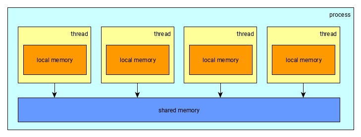
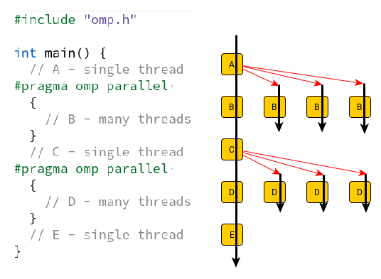
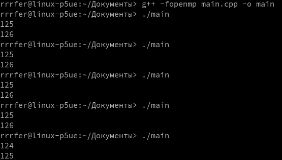

# 19. Паралельні обчислення за допомогою стандарту OpenMP ч.1

[Перелік усіх робіт](README.md)

## Мета роботи 

Ознайомитись із технологією OpenMP

## Обладнання

Персональний комп’ютер, Visual Studio 2008 або інша середа розробки для мови C++

## Теоретичні відомості

OpenMP – це бібліотека для паралельного програмування обчислювальних систем із загальною пам'яттю. Офіційно підтримується Сі, С++ та Фортран, проте можна знайти реалізації для деяких інших мов, наприклад Паскаль та Java. 

Бібліотеку OpenMP часто використовують у математичних обчисленнях, так як дозволяє дуже швидко і без особливих зусиль розпаралелити вашу програму. При цьому ідеологія OpenMP не дуже добре підійде при розробці серверного ПЗ. 

### Обчислювальні системи. Ідеологія OpenMP 

Існує безліч різновидів паралельних обчислювальних систем - багатоядерні/багатопроцесорні комп'ютери, кластери, системи на відеокартах, програмовані інтегральні схеми і т.д. Бібліотека OpenMP підходить лише для програмування систем із загальною пам'яттю, при цьому використовується паралелізм потоків. Потоки створюються у межах єдиного процесу і мають власну пам'ять. Крім того, всі потоки мають доступ до пам'яті процесу. 

|  |
| :--------------------------------------------- |
| Рис. Модель пам'яті в OpenMP                   |

Для використання бібліотеки OpenMP вам необхідно підключити заголовний файл `"omp.h"`, а також додати опцію складання `-fopenmp` (для компілятора gcc) або встановити відповідний прапорець у налаштуваннях проекту (для Visual Studio). Після запуску програми створюється єдиний процес, який починає виконуватись як і звичайна послідовна програма. Зустрівши паралельну область (задається директивою `#pragma omp parallel`) процес породжує ряд потоків (їх число можна задати явно, проте за замовчуванням буде створено стільки потоків, скільки у системі обчислювальних ядер). Кордони паралельної області виділяються фігурними дужками, наприкінці області потоки знищуються.
Щоб задати кількість потоків використайте `omp_set_num_threads()`

|  |
| :-------------------------------------------- |
| Рис. Директива omp parallel                   |

### Синхронізація – критичні секції, atomic, barrier 

Всі змінні, створені до директиви `parallel`, є спільними для всіх потоків. Змінні, створені всередині потоку, є локальними (приватними) і доступні тільки поточному потоку. При зміні загальної змінної одночасно декількома потоками виникає стан перегонів (ми не можемо гарантувати будь-який конкретний порядок запису і, отже, результат) це проблема і допускати таке не можна. Така сама проблема виникає, коли один потік намагається читати змінну в той час, як інший її змінює. Ситуацію пояснює такий приклад: 

```cpp
#include "omp.h"
#include <iostream>
int main() {
  int value = 123;
  #pragma omp parallel 
  {
    value++;
    #pragma omp critical
    {
      std::cout << value++ << std::endl;
    }
  }
}
```

Програма визначає змінну `value`, загальну всім потоків. Кожен потік збільшує значення змінної, потім виводить отримане значення на екран. Якщо запустити цю програму, можна отримати такі результати:

|  |
| :----------------------------------------------------- |
| Рис. Результати гонки потоків OpenMP                   |

Видно, що найчастіше спочатку кожен із потоків збільшить значення змінної, а потім вони по черзі виведуть результати (при цьому кожен із них ще раз збільшує значення), але в деяких випадках порядок виконання буде іншим. Нас же в цьому прикладі зараз цікавить, при спробі одночасного збільшення значення `value` програма може поводитися як завгодно - збільшити лише один раз або завершитися аварійно. 

Для вирішення проблеми існує директива `critical`. Розділяється ресурсом у цьому прикладі є не тільки пам'ять (розміщені в ній змінні), а й консоль (в яку потоки виводять результати). У прикладі гонки виникають при інкременті змінної, але не при виведенні на екран, т.к. операції з `cout` поміщені у критичну секцію. У критичній секції в один момент часу може бути тільки один потік, інші очікують на її звільнення. Правилом хорошого тону вважається, якщо критична секція містить звернення тільки до одного ресурсу, що розділяється (у прикладі секція не тільки виводить дані на екран, але й виконує інкремент — це не дуже добре, в загальному випадку. 

Для ряду операцій більш ефективно використовувати директиву `atomic`, ніж критичної секції. Вона поводиться також, але працює трохи швидше. Застосовувати її можна для операцій префіксного/постфіксного інкременту/декременту та операції типу **X BINOP = EXPR**, де **BINOP** є не перевантаженим оператором **+, *, -, /, &, ^, |, <<, >>**. Приклад використання такої директиви: 

```cpp
#include "omp.h"
#include <iostream>
int main() {
  int value = 123;
  #pragma omp parallel 
  {
    #pragma omp atomic
    value++;
    #pragma omp critical (cout)
    {
      std::cout << value << std::endl;
    }
  }
}
```

Тут же показана можливість імені критичних секцій - краще її використовувати завжди, бо всі безіменні секції розглядаються як одна (дуже велика) і якщо ви не дасте їм явно імена, то тільки в одній із цих секцій одночасно буде один потік. Інші чекатимуть.

Незважаючи на те, що кожна операція над загальними даними в останньому прикладі розміщена в критичній секції або є атомарною, є проблема, так як порядок виконання цих операцій, як і раніше, не визначено. Запустивши програму 20 разів ми можемо отримати на екрані не тільки **"125 125"**, але і **"124 125"**. Якщо ми хочемо, щоб спочатку кожен потік збільшив значення, а потім вони вивели їх на екран - можемо використовувати директиву `barrier`: 

```cpp
#pragma omp parallel 
{
  #pragma omp atomic
    value++;
  #pragma omp barrier
  #pragma omp critical (cout)
  {
    std::cout << value << std::endl;
  }
}
```

Потік, завершивши свою частину обчислень доходить до директиви `barrier` і чекає, поки всі потоки дійдуть до цієї ж точки. Дочекавшись останнього, потоки продовжують виконання. 

## Хід роботи

1. Завантажити Visual Studio 2008. Знайдіть на робочому столі ярлик з Visual Studio 2008 або Пуск → Всі програми→ Microsoft → Microsoft Visual Studio 2008.
2. Створити новий проект «Visual C++ (консольное приложение Win32)». Файл → Cтворити → Проект, тип проекту «Консольное приложение Win32».
3. Перевірити роботу роботу програми без використання `barrier` декілько разів:
4. 
```cpp
#include "omp.h"
#include <iostream>
int main() {
  int value = 123;
  #pragma omp parallel 
  {
    #pragma omp atomic
    value++;
    #pragma omp critical (cout)
    {
      std::cout << value << std::endl;
    }
  }
}
```

1. Перевірити роботу роботу програми з використанням `barrier`:
   
```cpp
#include "omp.h"
#include <iostream>
int main()
{
  int value = 123;
  #pragma omp parallel 
  {
    #pragma omp atomic
      value++;
    #pragma omp barrier
    #pragma omp critical (cout)
    {
      std::cout << value << std::endl;
    }
  }
}
```

## Контрольні запитання

1. Що таке OpenMP та для чого він використовується?
2. Які директиви використовуються для створення паралельних областей в OpenMP?
3. Як визначити кількість доступних потоків в OpenMP?
4. Які функції використовуються для керування кількістю потоків в OpenMP?
5. Які директиви використовуються для керування кількістю потоків в OpenMP?
6. Як визначити розмір кожного блоку даних, який буде оброблюватися кожним потоком в OpenMP?
7. Які директиви використовуються для розподілу роботи між потоками в OpenMP?
8. Які директиви використовуються для синхронізації потоків в OpenMP?


## Довідники та додаткові матеріали

1.  [OpenMP official website](https://www.openmp.org/)
2.  [OpenMP API Specification 5.1](https://www.openmp.org/wp-content/uploads/OpenMP-API-Specification-5.1.pdf)
3.  [OpenMP Language Specification on Microsoft Docs](https://docs.microsoft.com/en-us/cpp/parallel/openmp/reference/openmp-language-specification?view=msvc-160)
4.  [libgomp documentation (GCC implementation of OpenMP)](https://gcc.gnu.org/onlinedocs/libgomp/index.html#Top)
5.  [OpenMP support in Intel Threading Building Blocks](https://software.intel.com/content/www/us/en/develop/documentation/tbb-documentation/top/intel-threading-building-blocks-developer-reference-c/openmp-support/openmp-support-in-tbb.html)
6.  [OpenMP Tutorials and Articles](https://www.openmp.org/resources/tutorials-articles/)
7.  [Books on OpenMP](https://www.openmp.org/resources/books-3/)
8.  [Офіційний веб-сайт OpenMP](https://www.openmp.org/uk/)
9.  [Специфікація API OpenMP 5.1](https://www.openmp.org/wp-content/uploads/OpenMP-API-Specification-5.1.pdf)
10. [Специфікація мови OpenMP на Microsoft Docs](https://docs.microsoft.com/uk-ua/cpp/parallel/openmp/reference/openmp-language-specification?view=msvc-160)
11. [Документація libgomp (реалізація OpenMP в GCC)](https://gcc.gnu.org/onlinedocs/libgomp/index.html#Top)
12. [Підтримка OpenMP в Intel Threading Building Blocks](https://software.intel.com/content/www/us/en/develop/documentation/tbb-documentation/top/intel-threading-building-blocks-developer-reference-c/openmp-support/openmp-support-in-tbb.html)
13. [Навчальні матеріали та статті про OpenMP](https://www.openmp.org/resources/tutorials-articles/)
14. [Книги про OpenMP](https://www.openmp.org/resources/books-3/)