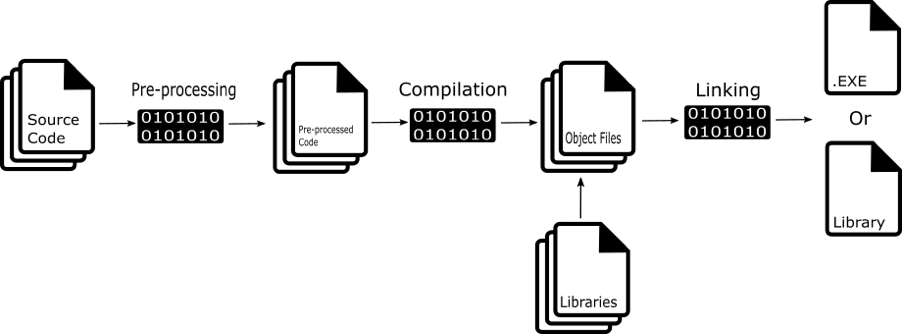

# Процес компіляції програми

[Перелік лекцій](README.md)

## Узагальнення


Компіляція програми на C++ включає взяття написаного нами вихідного коду (файли .cpp, .c, .h, .hpp) та перетворення їх у виконуваний файл або бібліотеку, яка може працювати на зазначеній платформі.

Цей процес можна розділити на три основні етапи:

1. Препроцесинг
2. Компіляція
3. Компонування



## Препроцесінг (попередня обробка)
У C++ є директиви препроцесора (ідентифікуються в коді префіксом #), що визначають перетворення, які мають виконуватися у вихідному коді до його компіляції.

Що робить препроцесор, залежить від директиви.

Препроцесор працює до компіляції і перетворює текст файлу програми відповідно до зустрічених у ньому або переданих у препроцесор директив. Технічно препроцесор може бути реалізований по-різному, але логічно його зручно представляти саме як окремий модуль, що повністю обробляє кожен призначений для компіляції файл і формує текст, який потім потрапляє на вхід компілятора. Препроцесор шукає в тексті рядки, що починаються із символу #, за яким повинні слідувати директиви препроцесора. Все, що не відноситься до директив препроцесора і не виключено з компіляції згідно директив, передається на вхід компілятора в незмінному вигляді.

До можливостей препроцесора входить:

- заміна заданої лексеми текстом за допомогою директиви #define, включаючи можливість створення параметризованих шаблонів тексту (викликаються аналогічно до функцій), а також скасовувати подібні заміни, що дає можливість здійснювати заміну на обмежених ділянках тексту програми;
- умовне вбудовування та видалення шматків з тексту, включаючи самі директиви, за допомогою умовних команд #ifdef, #ifndef, #if, #else та #endif;
- вбудовування у поточний файл тексту з іншого файлу за допомогою директиви #include.
Важливо розуміти, що препроцесор забезпечує лише підстановку тексту, не враховуючи синтаксис та семантику мови. Так, наприклад, макровизначення #define можуть зустрічатися всередині функцій або визначень типів, а директиви умовної компіляції можуть призводити до виключення з тексту програми, що компілюється, будь-якої частини коду, без огляду на граматику мови.

### Директиви препроцесора

Директиви препроцесора починаються зі знаку «решітка» - «#», який має бути самим першим символом рядка. Програма яка обробляє ці директиви, називається препроцесором (в сучасних компіляторах препроцесор зазвичай є частиною самого компілятора). Файли заголовків включаються в текст програми за допомогою директиви #include. Директива #include включає в програму вміст вказаного файлу. Ім'я файлу може бути вказано двома способами:
```
#include "my_file.h"
#include <string>
```
Якщо файл вказати у дужках вигляду (<>), вважається що нам потрібен стандартний файл заголовку, і компілятор буде шукати його в визначених місцях (які зазвичай задаються по різному для різних платформ, але вказують на місце знаходження стандартних бібліотек). Подвійні лапки означають, що файл користувацький, і його пошук починається з каталогу, де знаходиться вихідний текст програми.

Файл заголовку також може містити директиви #include. Тому іноді, важко зрозуміти, які конкретно файли заголовку вже включені в даний код і деякі файли заголовків можуть виявитись включеними декілька разів. Повторне включення файлу призводить до помилки компіляції із-за повтору імен. Уникнути цього дозволяють умовні директиви компілятора. Приклад:
```
#ifndef BOOKSTORE_H
...
#endif
```
Умовна директива #ifndef дозволяє перевірити, чи не було значення BOOKSTORE_H визначено раніше. (BOOKSTORE_H – константа препроцесора; такі константи прийнято писати великими буквами). Препроцесор дозволяє виконати наступні рядки коду програми до самого включення директиви #endif. У випадку коли умова не виконується і константа вже була визначена, він пропускає ці рядки, які знаходяться між #ifndef і #endif.

Директива `#define BOOKSTORE_H` визначає константу препроцесора під назвою BOOKSTORE_H. Розмістивши цю директиву безпосередньо після директиви #ifndef, ми можем гарантувати, що змістовна частина файлу заголовку буде включена в наш програмний код тільки один раз, скільки б разів не підключався сам файл заголовку.

## Компіляція
Компіляція є наступним етапом у процесі і пов'язана з перетворенням вихідного коду, який ми пишемо на щось зрозуміле комп'ютеру — машинний код.

Компіляція C++ як така є двоетапним процесом. По-перше, компілятор бере вихідний код і конвертує його в мову асемблера. Асемблер є мовою програмування низького рівня, яка більшою мірою схожа на машинні інструкції процесора.

По-друге, вихідний код, перетворений на мову асемблера, знову перетворюється на машинний код з використанням асемблера. В результаті виходить набір файлів, що зберігаються в проміжному форматі файлу, відомому як об'єктний файл.

Примітка: машинний код складається з команд, написаних у двійковому форматі, у термінах машинної мови, тому що саме це код, який фактично розуміє процесор.

Об'єктний модуль (також - об'єктний файл, англ. object file) - файл з проміжним представленням окремого модуля програми, отриманий в результаті обробки вихідного коду компілятором. Об'єктний файл містить у собі особливим чином підготовлений код (часто званий бінарним або двійковим), який може бути об'єднаний з іншими об'єктними файлами за допомогою редактора зв'язків (компонувальника) для отримання готового модуля або бібліотеки.

Об'єктні файли є блоками машинного коду та даних з невизначеними адресами посилань на дані та процедури в інших об'єктних модулях, а також список своїх процедур та даних. Компонувальник збирає код та дані кожного об'єктного модуля у підсумкову програму, обчислює та заповнює адреси перехресних посилань між модулями. Зв'язування зі статичними бібліотеками виконується редактором зв'язків або компонувальником (який може являти собою окрему програму або бути частиною компілятора), а з операційною системою та динамічними бібліотеками зв'язування виконується під час виконання програми після її завантаження на згадку.

На етапі компіляції ми будемо попереджені про будь-які помилки в нашому коді, які призводять до того, що код не компілюється. Усі помилки цьому етапі викликані тим, що компілятор не розуміє написаний нами код.

Код не розпізнається C++, якщо ми десь переплутали наш синтаксис. У типових прикладах невдалої компіляції не вистачає крапки з комою, неправильно написано ключове слово C++ або додано занадто багато фігурних дужок наприкінці методу.

Якщо виявлено помилку, компіляція повністю зупиняється. Ви не зможете скомпілювати свій C++ код, доки всі помилки не будуть виправлені.

## Компоновка
Завершальним етапом процесу є компонування, яке пов'язане з вилученням наших результатів з попереднього кроку та зв'язуванням всього цього разом для створення фактичного файлу або бібліотеки, що виконується.


Першим кроком цьому етапі є компіляція всіх об'єктних файлів у виконуваний файл чи бібліотеку. Як тільки цей крок буде успішно завершено, наступним кроком буде зв'язування цього файлу з будь-якими зовнішніми бібліотеками, які ми хочемо використовувати в нашій програмі.

Примітка: бібліотека — це колекція функцій, класів та об'єктів, які мають спільне призначення, наприклад, математична бібліотека.

Зрештою, компонувальник повинен дозволити всі залежності. Це місце, де відбуваються всі помилки, пов'язані з компонуванням.

Серед поширених помилок можна виділити неможливість знайти вказану бібліотеку чи спробу зв'язати два файли, які, наприклад, можуть мати класи з однаковими іменами.

Припускаючи, що на цьому етапі помилок не виникне, компілятор надасть нам файл або бібліотеку, що виконується.

## Збірка
Я думаю, варто згадати ще одну річ: у IDE, такому як Visual Studio, описані кроки компіляції згруповані в процес, званий складання (build). Типовий робочий процес під час створення програми — складання, та був налагодження (debug).

Відбувається наступне: збірка створює файл, що виконується (шляхом компіляції та компонування коду) або список помилок залежно від того, наскільки добре ми впоралися з написанням коду з часу нашого останнього складання. Коли ми натиснемо Start Debugging, Visual Studio запустить створений виконуваний файл.